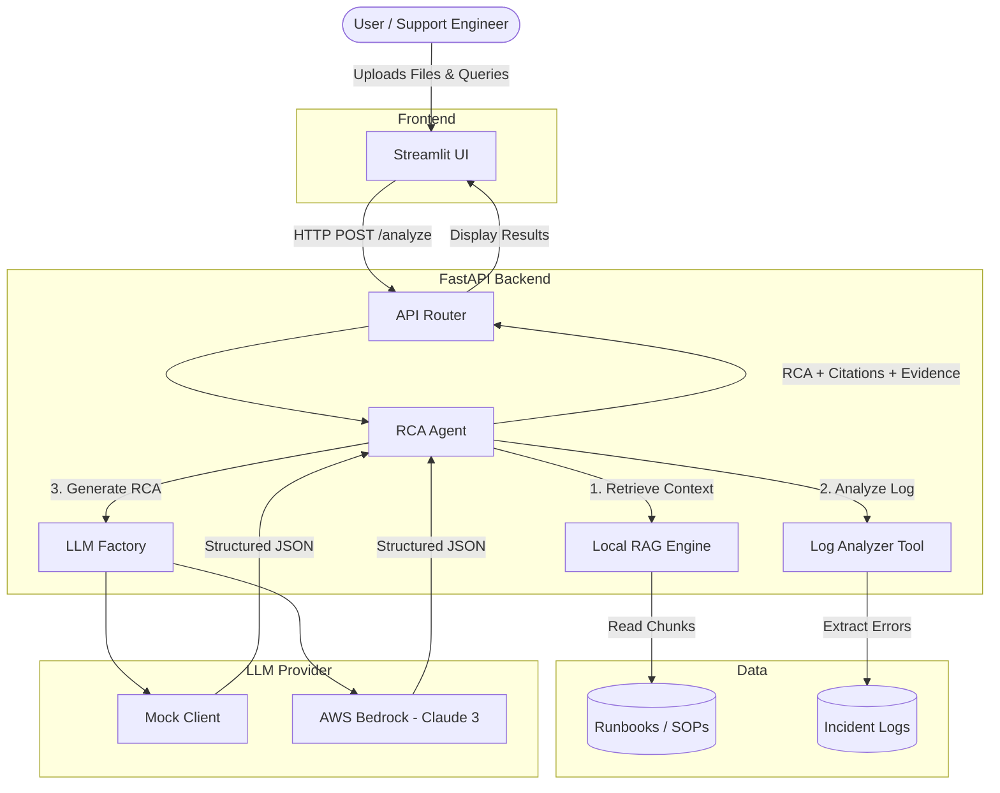

# Architecture Diagram

The following Mermaid diagram illustrates the data flow and component interactions within the Bedrock RCA Copilot.

```mermaid
graph TD
    User([User / Support Engineer])

    subgraph Frontend
        UI[Streamlit UI]
    end

    subgraph Backend [FastAPI Backend]
        API[API Router]
        Agent[RCA Agent]
        RAG[Local RAG Engine]
        LogTool[Log Analyzer Tool]
        Factory[LLM Factory]
    end

    subgraph Data
        Docs[(Runbooks / SOPs)]
        Logs[(Incident Logs)]
    end

    subgraph LLM Provider
        Mock[Mock Client]
        Bedrock[AWS Bedrock - Claude 3]
    end

    User -->|Uploads Files & Queries| UI
    UI -->|HTTP POST /analyze| API

    API --> Agent

    Agent -->|1. Retrieve Context| RAG
    RAG -->|Read Chunks| Docs

    Agent -->|2. Analyze Log| LogTool
    LogTool -->|Extract Errors| Logs

    Agent -->|3. Generate RCA| Factory
    Factory --> Mock
    Factory --> Bedrock

    Mock -->|Structured JSON| Agent
    Bedrock -->|Structured JSON| Agent

    Agent -->|RCA + Citations + Evidence| API
    API -->|Display Results| UI
```
